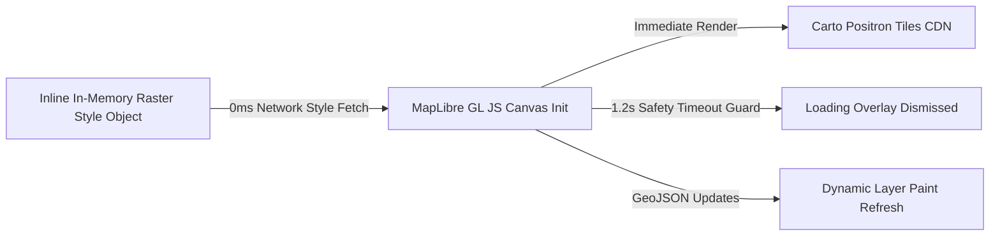

# PRAVAAH — Spatial Intelligence Canvas & Map Architecture

**Date**: 2026-08-25  
**Version**: MapLibre GL JS + Carto Positron Raster Integration

---

## 1. Overview & Core Philosophy

The PRAVAAH Map is the primary **spatial intelligence canvas** for the city operations control room and visitor experience. It transforms raw sensor telemetry, graph topology, and machine-learning predictions into actionable spatial intelligence.

The map visually answers five critical operational questions:
1. **WHERE IS PRESSURE NOW?** — Real-time crowd density polygons, flow velocity vectors, and transit station saturation rings.
2. **WHERE WILL PRESSURE MOVE?** — Multi-horizon (+30m, +60m, +120m, +180m) LightGBM residual forecasts, hotspot halos, and corridor propagation paths.
3. **WHAT IS CAUSING THE PROBLEM?** — Active disruption overlays (e.g. Central Line rail blockage) with capacity reduction metrics and cascade bottlenecks.
4. **WHAT ACTION IS PRAVAAH RECOMMENDING?** — Spatial redirection corridors (e.g. Curry Road $\to$ Thane Suburban Buffer) with dosage flows and gating rates.
5. **WHAT HAPPENS IF THAT ACTION IS TAKEN?** — Before vs After counterfactual simulation deltas comparing baseline pressure against simulated relief.

---

## 2. Interactive Map Modes

| Mode | Visual Purpose | Primary Map Features |
|------|----------------|----------------------|
| **CURRENT** | Live city state | Calibrated crowd density polygons (Teal &lt;50, Amber 50–69, Orange 70–84, Red &ge;85), numeric badges (`82/100`), station occupancy circles. |
| **FORECAST** | Multi-horizon future state | Temporal slider (+30m, +60m, +120m, +180m), glowing hotspot halos, predicted pressure deltas ($+18$ pts). |
| **NETWORK** | Infrastructure topology | Railway corridors (Central, Western, Harbour lines), node interchanges, directional route capacities. |
| **DISRUPTIONS** | Failure & bottleneck analysis | Red dashed line marking blocked corridor, station ingress warning badges, spillover roadway indicators. |
| **INTERVENTION** | Decision engine guidance | Action flow corridor (Curry Road $\to$ Dadar $\to$ Thane), dosage label (18% Redirection ~2,500/hr), and expected target relief. |
| **WHAT-IF** | Counterfactual impact | Before Action vs After Action toggle comparing Curry Road 94 &rarr; 76, Lalbaug 88 &rarr; 74, Thane 54 &rarr; 62 (Critical zones: 3 &rarr; 1). |

---

## 3. High-Performance Initialization & Zero Latency Fix

- **Inline Style**: The style object is stored directly in JavaScript memory ([`frontend/src/config/map.js`](file:///d:/.gemini/antigravity/scratch/pravaah/frontend/src/config/map.js)), eliminating remote `style.json` round-trips, fontstack downloads, and sprite latency.
- **Safety Timer**: A 1.2-second timer guarantees the loading overlay is dismissed under all conditions.
- **Efficient Updates**: State changes use `map.getSource(...).setData(...)`, modifying layer data in WebGL memory without re-instantiating the MapLibre instance.

---

## 4. Demo Mode & Judge Tour Integration

The map synchronizes with the 6-event demo progression:
- **Event 0 (Normal)** &rarr; CURRENT mode, calm baseline.
- **Event 1 (Pressure Rising)** &rarr; Camera smooth pan to Curry Road hotspot.
- **Event 2 (Forecast Warning)** &rarr; Auto-switches to FORECAST (+120m), showing Curry Road climbing to 94.
- **Event 3 (Recommendation)** &rarr; Auto-switches to INTERVENTION, drawing orange redirection path to Thane.
- **Event 4 (Central Line Disruption)** &rarr; Auto-switches to DISRUPTIONS, highlighting blocked Central Line segment with ⚠ warning.
- **Event 5 (New Recommendation)** &rarr; WHAT-IF mode, comparing Before vs After pressure reduction.
