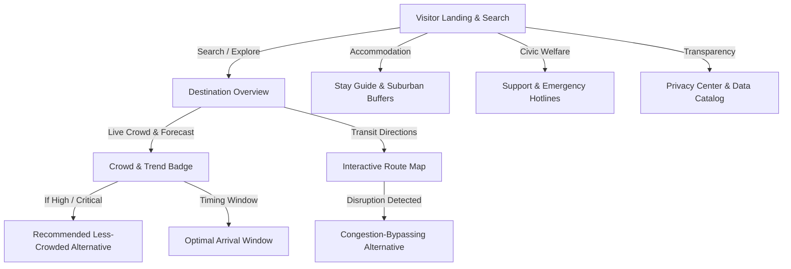

# PRAVAAH — Visitor Experience Architecture & Guide

**Phase 11 + Phase 20 · End-to-End Implementation**  
Date: 2026-08-25

---

## 1. Overview & Product Goal

PRAVAAH operates on two connected surfaces powered by the same underlying predictive intelligence:

| Role | Core Question | UX Character |
|------|---------------|--------------|
| **City Operator** | *"What should the city do?"* | Comprehensive control room, multi-horizon forecasts, intervention levers, what-if counterfactuals, glass box audit. |
| **Visitor / Traveler** | *"Where should I go, when should I go, and is there a better route/option?"* | Calm, mobile-first, zero jargon, instant search, crowd badges, trend arrows, optimal arrival windows, and congestion-bypassing routes. |

---

## 2. Canonical Visitor Journey

---

## 3. Visitor API Layer

All visitor endpoints strictly enforce **public-safe serialization** and **k-anonymity aggregation** via `backend/services/privacy_service.py`:

| Endpoint | Method | Purpose | Public Payload Fields |
|----------|--------|---------|-----------------------|
| `/api/visitor/destinations` | `GET` | All monitored festival locations | `destination_id`, `name`, `category`, `area`, `crowd_level`, `crowd_label`, `trend`, `trend_icon`, `expected_crowd`, `travel_time_min`, `travel_status`, `lat`, `lng`, `keywords` |
| `/api/visitor/destinations/<id>` | `GET` | Detailed destination profile | `destination_id`, `name`, `category`, `area`, `description`, `crowd_level`, `crowd_index`, `forecast` (+30m, +60m, +120m, +180m with trends), `best_time`, `disruption_notice`, `lat`, `lng` |
| `/api/visitor/recommendations` | `POST` | Intelligent destination guidance | `recommendation_type` (`CURRENT` / `ALTERNATIVE`), `original_destination`, `destination_id`, `name`, `crowd_level`, `travel_time_min`, `why` (computed reasons), `best_time`, `disruption_notice` |
| `/api/visitor/route` | `GET` | Dynamic transit shortest path | `origin`, `destination`, `total_travel_time_min`, `total_distance_km`, `travel_status`, `steps`, `geometry` (GeoJSON LineString), `disruption_notice` |
| `/api/visitor/conditions` | `GET` | City-wide aggregated summary | `total_destinations`, `busy_count`, `moderate_count`, `quiet_count`, `overall_status` |
| `/api/visitor/stay` | `GET` | Accommodation availability | `summary` (available rooms, avg price), `zones` (Core vs Suburban Buffers), `recommendation` |
| `/api/visitor/support` | `GET` | Civic welfare & emergencies | `summary`, `amenities` (Drinking Water, Medical Aid, Police Help Desks, Sanitation) |
| `/api/visitor/privacy` | `GET` | Privacy policy & catalog | `policy` (`we_use`, `we_do_not_use`, `why`), `principles`, `catalog` (data types, retention) |

---

## 4. Visitor Decision & Recommendation Engine

Recommendations are calculated from live prediction and network state via `VisitorRecommendationEngine`:

1. **Alternative Candidate Scoring**:
   $$\text{Score} = w_{\text{pressure}} \cdot \frac{P}{100} + w_{\text{time}} \cdot \frac{T + T_{\text{disruption}}}{60} + w_{\text{disruption}} \cdot D$$

2. **Preference Weightings**:
   - `LESS_CROWDED`: Prioritizes lowest crowd index ($\Delta P \ge 8$ points).
   - `FASTEST`: Prioritizes shortest travel time.
   - `AVOID_DISRUPTION`: Heavily penalizes corridors affected by active scenario disruptions.
   - `LOWER_TRAVEL_TIME`: Balances distance and crowd.

3. **Disruption Awareness**:
   - If Central Line railway corridor is closed or restricted, the visitor engine automatically flags affected central pandals (`curry-road-pandal`, `lalbaugcha-raja`) as `SLOW` / `DISRUPTED`, and routes visitors through open Western or suburban rail paths.

---

## 5. Privacy & Data Minimization Architecture

PRAVAAH enforces strict privacy boundaries:

- **No GPS tracking**: Approximate location uses neighbourhood-level resolution only.
- **No persistent user IDs**: Zero cookies, zero device identifiers, zero personal profiles.
- **K-Anonymity suppression**: Groups $< 10$ are suppressed.
- **Operator separation**: Visitor responses never expose raw regression coefficients, intervention dosage percentages, candidate matrix scores, or internal database keys.

---

## 6. Map Reliability & MapLibre Integration

- Uses **Carto Positron GL** production CDN basemap (`https://basemaps.cartocdn.com/gl/positron-gl-style/style.json`).
- `MumbaiMap` container uses `absolute inset-0 w-full h-full` on a positioned wrapper to prevent zero-height canvas errors.
- Real-time GeoJSON layer rendering for route LineStrings, origin/destination points, and transit corridors.
- Non-fatal tile warnings are caught and logged silently without triggering broken error screens.
